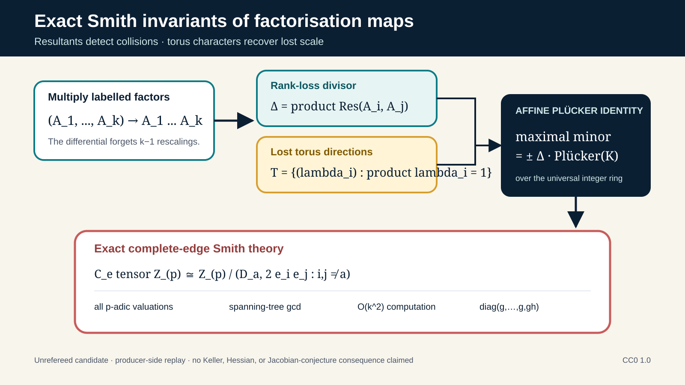

# Exact Smith Invariants and Affine Determinant Lines of Binary-Form Factorisation

**Anonymous · version 0.1.0-candidate · unrefereed research candidate**

This repository contains a mathematical manuscript, exact symbolic checks,
review records, and a deterministic research package. It is a separately
versioned extension of the original
[*Bordered Jacobian Foundations*](https://evidencepress.org/releases/bordered-jacobian-foundations/)
candidate ([immutable parent DOI](https://doi.org/10.5281/zenodo.21855302)).
It does not modify, correct, supersede, or independently reproduce the parent.



## What the paper proves

For multiplication of labelled binary forms, every maximal minor of the
coefficient differential factors into two geometrically meaningful pieces:

1. the product of pairwise resultants, which detects root collisions; and
2. the matching Plücker coordinate of the product-one scaling torus, which
   records the dimensions lost to rescaling.

The strongest candidate contribution is an exact local and global computation
of the Smith invariants of the complete pairwise-resultant character lattice.
It supplies every prime-adic valuation, a closed global formula, an
`O(k^2)` gcd algorithm, a spanning-tree gcd theorem, and the nonprimitive
Smith form

```text
diag(g, ..., g, g h(e)).
```

The paper does **not** classify arbitrary polynomial normalisers or affine
slices, and it proves no Keller-map, Hessian-conjecture, or
Jacobian-conjecture consequence.

## Start here

- [Paper (PDF)](package/manuscript/determinant_lines_character_lattices.pdf)
- [Paper source (Markdown)](package/manuscript/determinant_lines_character_lattices.md)
- [Plain-English summary](assets/audio/plain-english-summary.txt)
- [AI-generated audio summary](assets/audio/plain-english-summary.mp3)
- [Assurance statement](ASSURANCE.md)
- [Parent binding](package/provenance/PARENT.md)
- [Claims registry](package/integrity/claims.json)
- [Full research package](package/)

## Exact replay

The producer environment used CPython 3.13.5, SymPy 1.14.0,
python-flint 0.9.0, and jsonschema 4.26.0.

```bash
python3 -m pip install -r package/requirements.txt
make -C package compare
make -C package claims
make -C package verify
make -C package integrity
```

The expected total is **129,352 positive exact comparisons** and all
**18 deliberate negative controls detected**, under ordinary and `python -O`
execution. These are producer-side regression checks, not independent
reproduction or peer review.

## Release identity

- Candidate version: `0.1.0-candidate`
- Immutable tag: `v0.1.0-candidate`
- Repository: <https://github.com/ipitchford/exact-smith-invariants-affine-determinant-lines>
- GitHub prerelease:
  <https://github.com/ipitchford/exact-smith-invariants-affine-determinant-lines/releases/tag/v0.1.0-candidate>
- Version DOI: <https://doi.org/10.5281/zenodo.21861347>
- Concept DOI: <https://doi.org/10.5281/zenodo.21861346>
- Evidence Press page:
  <https://evidencepress.org/releases/exact-smith-invariants-affine-determinant-lines/>
- Parent DOI: <https://doi.org/10.5281/zenodo.21855302>
- Parent Evidence Press page:
  <https://evidencepress.org/releases/bordered-jacobian-foundations/>

## Licence and AI disclosure

Original manuscript text, documentation, review records, release metadata, and
graphics are dedicated under CC0 1.0. Original source code is licensed under
MIT. Third-party cited works retain their own rights.

AI systems assisted with source discovery, mathematical exploration, proof
development, exact-check implementation, adversarial testing, drafting,
graphics, narration, and packaging. AI systems are not authors. The audio uses
an AI-generated voice and is a communication aid, not mathematical evidence.
