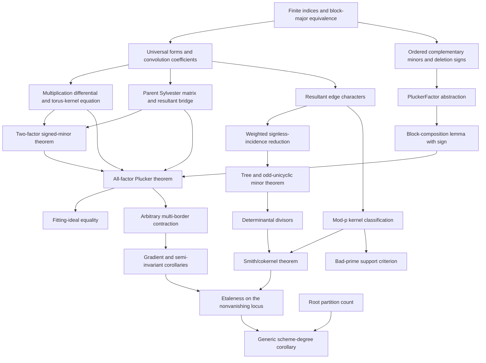

# Lean formalisation blueprint

## Resultant-Character Lattices of Binary-Form Factorisations

**Blueprint status:** implementation plan, not a completed formalisation  
**Prepared:** 9 August 2026  
**Target proof assistant:** Lean 4 with Mathlib pinned by commit  
**Parent relationship:** separate follow-up to the immutable
`v0.3-candidate` parent; the parent repository is an input, never an
implementation workspace

This document specifies a kernel-checkable route from the two-factor bordered
Jacobian theorem to the all-factor determinant-line and character-lattice
theorems. It fixes the conventions that carry signs, separates universal
polynomial identities from field- and scheme-level consequences, and defines
completion gates. Nothing in this blueprint is itself a formal proof.

## 1. Formalisation boundary

### 1.1 Core target

The first formalisation milestone should certify the following statements over
the universal integer coefficient ring:

1. the parent two-factor signed maximal-minor identity;
2. the complementary-minor composition lemma, including the factor
   \((-1)^{t_1}\);
3. the all-factor
   \(\varepsilon_{\mathbf d}\Delta_{\mathbf d}\)-times-Plücker identity;
4. the arbitrary-matrix multi-border contraction;
5. the semi-invariant character-determinant corollary;
6. the weighted tree and tree/odd-unicyclic character-minor formulas;
7. the determinantal-divisor and modular-rank statements underlying the Smith
   form and bad-prime criterion.

These are algebraic and combinatorial statements. They require no smoothness,
root coordinates, Zariski-density argument, or analytic reasoning.

### 1.2 Secondary target

The following results should be formalised only after the core target compiles
without placeholders:

* the exact maximal-minor/Fitting ideal equality;
* the description of the kernel on the pairwise-coprime locus;
* the residual finite diagonalizable group associated with the Smith form;
* the generic scheme-degree and étaleness corollary.

The secondary target introduces localisations, finite group schemes, finite
morphisms, or root-partition arguments. It must live in separate modules so
that these hypotheses cannot leak into the universal determinant theorem.

### 1.3 Explicit exclusions

This project does not formalise or claim:

* classification of arbitrary polynomial normalisers;
* recognition of an exceptional slice as affine space;
* classification or uniqueness of factorisation-derived Keller maps;
* a Jacobian- or Hessian-conjecture consequence;
* novelty, priority, peer review, or independent reproduction.

## 2. Exact universal conventions

The Lean statements must encode the manuscript's conventions directly rather
than recover them by prose after a theorem has compiled.

### 2.1 Parameters and dimensions

Use:

```lean
variable (k : ℕ) (hk : 2 ≤ k)
variable (d : Fin k → ℕ) (hd : ∀ i, 0 < d i)

abbrev D : ℕ := ∑ i, d i
abbrev t : ℕ := k - 1
abbrev n : ℕ := D d + 1
abbrev N : ℕ := D d + k
```

The source-coordinate type before flattening is

```lean
abbrev CoeffIdx := Σ i : Fin k, Fin (d i + 1)
```

Its cardinality is \(N=D+k\). The identity
\(\sum_i(d_i+1)=\sum_i d_i+k\) should be a named lemma, not left to
normalisation at every use.

### 2.2 Block-major source order

The orientation is fixed by the zero-based block-major index

\[
 \operatorname{flat}(i,j)=
 \sum_{h<i}(d_h+1)+j.
\]

Construct a single equivalence

```lean
coeffIdxEquivFin : CoeffIdx k d ≃ Fin (N d)
```

whose forward map is the displayed formula. Prove and expose:

* strict monotonicity within each coefficient block;
* every coordinate of factor \(i\) precedes every coordinate of factor
  \(i+1\);
* the formula for the last factor's offset;
* compatibility with recursive splitting into the first \(k-1\) blocks and
  the last block.

All matrices used in a determinant statement are transported through this one
equivalence. No theorem may use an arbitrary `Fintype.equivFin` because its
unspecified ordering would make the orientation assertion meaningless.

### 2.3 Universal coefficient ring and forms

Let

```lean
abbrev S := MvPolynomial (CoeffIdx k d) ℤ
```

and define the dehomogenised universal polynomial

\[
 A_i(T)=\sum_{j=0}^{d_i} a_{i,j}T^j
 \quad\text{in } S[T],
\]

where `a i j := MvPolynomial.X ⟨i,j⟩`. This is the dehomogenisation
of

\[
 \sum_{j=0}^{d_i}a_{i,j}X^{d_i-j}Y^j
\]

at \(X=1,Y=T\). Thus Lean's ascending `Polynomial.coeff` order agrees with
the manuscript's coefficient order.

Prove `natDegree (A i) = d i` in the universal domain. Do not rely on a
runtime assertion that the top coefficient is nonzero.

### 2.4 Parent Sylvester convention

For polynomials padded to prescribed degrees \(r,s\), define
`parentSylvester r s A B` explicitly as the \((r+s)\)-square matrix with:

* the first \(s\) rows equal to shifted ascending coefficient vectors of
  \(A\);
* the next \(r\) rows equal to shifted ascending coefficient vectors of
  \(B\).

Set

```lean
def parentResultant (r s : ℕ) (A B : Polynomial R) : R :=
  Matrix.det (parentSylvester r s A B)
```

and prove, under exact-degree hypotheses, that it equals
`Polynomial.resultant A B` in the pinned Mathlib convention. Until that bridge
is proved, every sign-sensitive main theorem should use `parentResultant`.
This prevents a library convention change or an unexamined transpose from
moving a sign into the theorem.

For \(i<j\), write

\[
 R_{ij}=\operatorname{parentResultant}(d_i,d_j;A_i,A_j),\qquad
 \Delta_{\mathbf d}=\prod_{i<j}R_{ij},
\]

with pairs enumerated lexicographically only for reproducibility; the product
itself is commutative.

### 2.5 Multiplication differential

Define the product polynomial and its coefficient vector:

\[
 P(T)=\prod_iA_i(T),\qquad c_q=[T^q]P(T).
\]

The differential matrix \(M\) has rows `Fin (D+1)` and block-major columns
`Fin N`. Its entry at output coefficient \(q\) and source coefficient
\((i,j)\) is

\[
 M_{q,(i,j)}=[T^{q-j}]\prod_{h\ne i}A_h(T),
\]

with `Polynomial.coeff` supplying zero outside the natural range.

Use this convolution formula as the primary definition. Separately prove that
it equals the matrix of formal partial derivatives
\(\partial c_q/\partial a_{i,j}\). The main determinant theorem then does not
depend on the current shape of Mathlib's multivariate-derivative API.

### 2.6 Ordered torus-kernel matrix

Let the last factor be `Fin.last (k - 1)`. For
\(b=0,\ldots,k-2\), define the row

\[
 \kappa_b=(0,\ldots,A_b,\ldots,0,-A_{k-1}).
\]

The matrix \(K\) has rows `Fin (k-1)` and the same flattened columns as
\(M\). Its entries are the corresponding universal coefficients, their
negatives on the final block, and zero elsewhere.

Prove first:

```lean
torusKernel_mul_transpose : M * Kᵀ = 0
```

by coefficient convolution. This is a structural lemma and a useful early
test of all index maps.

### 2.7 Deleted columns and complementary-minor sign

For a finite set `I : Finset (Fin N)` with `I.card = t`, define:

* `selectedEquiv I : Fin t ≃ ↑I`, increasing in `Fin N`;
* `complementEquiv I : Fin n ≃ {j : Fin N // j ∉ I}`, also increasing;
* `kernelMinor K I`, the determinant of the \(t\)-square submatrix selected by
  `selectedEquiv`;
* `sourceMinor M I`, the determinant of the \(n\)-square submatrix selected by
  `complementEquiv`.

The signed Plücker coordinate is

\[
 p_I(M)=(-1)^{\sum_{i\in I}i}\det M_{\widehat I},
\]

where the sum uses zero-based `Fin.val`. In Lean, cast the integer sign into
the coefficient ring through a helper

```lean
def deletionSign (I : Finset (Fin N)) : R :=
  (-1 : R) ^ (∑ i in I, i.val)
```

Avoid using the position of an element inside an unordered `Finset`.

### 2.8 Orientation scalar

Define

\[
 E(\mathbf d)=
 \sum_{i<j}d_i(d_j+1)+\binom{k+1}{2}+1,
 \qquad
 \varepsilon_{\mathbf d}=(-1)^{E(\mathbf d)}.
\]

Required parity lemmas are:

```lean
orientation_two_factor
orientation_step
orientation_three_factor
```

with

\[
 E_k\equiv E_{k-1}+D'(d_k+1)+(k-2)\pmod2,
 \qquad D'=\sum_{i<k}d_i.
\]

The two-factor reduction must simplify to
\((-1)^{d_0(d_1+1)}\), exactly the parent's signed-minor exponent.

## 3. Formal theorem statements

Names below are proposed stable public declarations. Internal helper names may
change during implementation.

### 3.1 Two-factor base

```lean
theorem twoFactor_signedMaximalMinor
    (I : Finset (Fin (r + s + 2))) (hI : I.card = 1) :
    signedSourceMinor (twoFactorDifferential r s) I =
      (-1 : S) ^ (r * (s + 1)) *
      parentResultant r s A B * kernelMinor (twoFactorKernel r s) I
```

This theorem must be proved inside the child package. Importing the prose
statement from the parent is not formalisation.

### 3.2 Composition theorem

Define a predicate `PluckerFactor A K c` saying that every signed maximal
minor of a full-width rectangular matrix `A` equals `c` times the matching
minor of the ordered kernel-row matrix `K`.

For an inner matrix of corank \(t_1\), its direct sum with an identity block,
an outer matrix of corank one, an ordered inherited kernel, and a specified
lift of the outer kernel, prove:

```lean
theorem pluckerFactor_block_comp
    (hP : PluckerFactor P KP cP)
    (hL : PluckerFactor L KL cL)
    (hlift : isKernelLift PplusI KL lift) :
    PluckerFactor (L * PplusI) (stack KP lift)
      ((-1) ^ t₁ * cP * cL)
```

The proof should be a complementary Cauchy–Binet or exterior-power identity,
not a field argument using division by a chosen nonzero minor. That choice is
what permits the final theorem over arbitrary commutative rings.

### 3.3 All-factor Plücker theorem

```lean
theorem allFactor_signedMaximalMinor
    (I : Finset (Fin (N d))) (hI : I.card = k - 1) :
    signedSourceMinor (multiplicationDifferential d) I =
      orientation d * collisionProduct d *
      kernelMinor (torusKernel d) I
```

Equivalently expose the bundled statement:

```lean
theorem allFactor_pluckerFactor :
  PluckerFactor (multiplicationDifferential d) (torusKernel d)
    (orientation d * collisionProduct d)
```

The induction factors multiplication through

\[
 \prod_{i<k}V_{d_i}\longrightarrow V_{D'}
 \quad\text{and}\quad
 V_{D'}\times V_{d_k}\longrightarrow V_D.
\]

Required supporting identities are:

* exact block decomposition of the differential;
* multiplicativity
  \(\operatorname{Res}(\prod_{i<k}A_i,A_k)
  =\prod_{i<k}\operatorname{Res}(A_i,A_k)\) in the parent convention;
* the inherited rows \(\eta_b\) and lifted row \(\ell\) lie in the kernel;
* the change from \((\eta_0,\ldots,\eta_{k-3},\ell)\) to the standard
  \((\kappa_0,\ldots,\kappa_{k-2})\) is unit upper triangular and has
  determinant one;
* `orientation_step` supplies the final parity identity.

### 3.4 Multi-border theorem

The strongest algebraic statement uses an arbitrary
`G : Matrix (Fin t) (Fin N) S`, not necessarily a gradient. Let `stackRows M G`
use the canonical target-then-border row order.

```lean
theorem det_stack_eq_collision_mul_verticalDet
    (G : Matrix (Fin (k - 1)) (Fin (N d)) S) :
    det (stackRows (multiplicationDifferential d) G) =
      (-1 : S) ^ ((D d + 1) * (k - 1) + Nat.choose (k - 1) 2) *
      orientation d * collisionProduct d *
      det (torusKernel d * G.transpose)
```

This should follow from a reusable lemma:

```lean
theorem det_stack_of_pluckerFactor
    (h : PluckerFactor M K c) :
    det (stackRows M G) = borderSign n t * c * det (K * G.transpose)
```

Only afterward define a gradient matrix and torus derivations
\(\delta_b=\sum_jK_{b,j}\partial_j\). The differential version is a
corollary of the arbitrary-border theorem.

### 3.5 Semi-invariant corollary

Avoid requiring a developed affine-torus action for the first kernel theorem.
Use the Euler equations as explicit hypotheses:

```lean
theorem det_jacobian_of_characterEquations
    (hchar : ∀ a b, verticalDerivative K g a b = W a b * g a) :
    det (jacobianWithBorders M g) =
      totalSign d * collisionProduct d * det W * ∏ a, g a
```

A later module may prove `hchar` from a genuine `T`-semi-invariant action.

### 3.6 Character graph theorem

After eliminating \(u_{k-1}=-\sum_{b<k-1}u_b\), define the integer edge row

\[
 \chi_{ij}=d_j e_i+d_i e_j
\]

with the last-coordinate contribution subtracted from every retained column.
For a set \(H\) of \(k-1\) edges, define the square matrix `characterMinor d H`.

The formal target should use absolute integer determinant:

```lean
theorem characterMinor_natAbs_det
    (hcard : H.card = k - 1) :
    Int.natAbs (det (characterMinor d H)) =
      predictedGraphMinor d H
```

Here `predictedGraphMinor` is zero unless there is exactly one tree component
and every other component is odd unicyclic. In the nonzero case it is

\[
 2^{c-1}
 \left|\sum_{i\in P}d_i-\sum_{j\in Q}d_j\right|
 \prod_i d_i^{\deg_H(i)-1}.
\]

Because isolated vertices have exponent \(-1\), implement the product first as
the integral quotient obtained from row/column scaling, or use a rational
identity plus a divisibility lemma. Do not encode negative natural exponents.
For a spanning tree, all valences are positive and the direct natural-power
formula is safe.

### 3.7 Smith and bad-prime theorems

Let `WE d` be the full \(\binom{k}{2}\)-by-\((k-1)\) edge-character matrix,
\(g=\gcd_i d_i\), \(e_i=d_i/g\), and

\[
 h(\mathbf e)=\gcd_{|H|=k-1}|\det W_H(\mathbf e)|.
\]

Formalise in this order:

1. every primitive reduction `WE e` has rank at least \(k-2\) over
   `ZMod p`;
2. the gcd of primitive \((k-2)\)-minors is one;
3. the maximal determinantal divisor is \(h(\mathbf e)\);
4. the nonzero Smith entries are
   \((g,\ldots,g,gh)\);
5. the cokernel is
   \((\mathbb Z/g)^{k-2}\oplus\mathbb Z/(gh)\);
6. prime support of \(h\) is exactly:
   * `p = 2` and an even number of primitive degrees are odd; or
   * `p` odd, exactly two primitive degrees are nonzero modulo `p`, and those
     two residues agree.

If Mathlib's Smith-normal-form API does not expose the required rectangular
classification at the pinned revision, take the determinantal-divisor theorem
and the explicit cokernel equivalence as the kernel-checked primary result.
The phrase “Smith form” may be used in the manuscript only after the bridge to
the conventional Smith-normal-form statement is compiled.

### 3.8 Geometric corollaries

The generic-degree result

\[
 |\det W|\frac{D!}{\prod_i d_i!}
\]

has two logically separate factors. Formalise them separately:

* a finite combinatorial theorem counting labelled partitions of a `Fin D`
  root set into blocks of sizes \(d_i\);
* a torus-isogeny theorem giving finite group-scheme order \(|\det W|\) and
  the criterion that the isogeny is étale exactly when `det W` is invertible
  in the base field.

The final multiplication-map degree theorem additionally needs a generic
squarefree-factorisation bridge. Mark it `secondary` until that bridge exists.
Do not use reduced geometric point count in place of scheme degree in bad
characteristic.

## 4. Dependency graph



The core completion gate ends at `L`, `O`, `Q`, and `S`. Nodes `J`, `T`, and
`V` are secondary and may not block a first algebraic formalisation release if
their status is disclosed precisely.

## 5. Mathlib prerequisites and expected gaps

### 5.1 Pinning rule

Bootstrap against Mathlib commit
`1f0fbd1ad9ff6e4751ab4564fc70cc4f2a1fadf9`, the revision audited by the
parent on 6 August 2026. The project's `lean-toolchain` must be copied from or
resolved by that Mathlib revision. Do not combine the host's currently
installed Lean version with an untested Mathlib commit.

Before substantive implementation, create a compiling `PrereqAudit.lean`
containing `#check` commands for every library declaration named below. Freeze
the resolved import list and commit hashes in the package manifest.

### 5.2 Known library ingredients at the audited pin

| Need | Audited Mathlib declaration or area | Intended use |
|---|---|---|
| Sylvester matrix | `Polynomial.sylvester` | Convention bridge |
| Polynomial resultant | `Polynomial.resultant` | Library-facing resultant API |
| Coprimality criterion | `isUnit_resultant_iff_isCoprime` | Pairwise-coprime localisation |
| Product/evaluation formula | `resultant_eq_prod_eval` under monic normalisation | Multiplicativity support |
| Monic multiplication Jacobian | `universalFactorizationMapPresentation_jacobiMatrix` | Two-factor truncated-matrix ingredient |
| Universal coprime factorisation ring | `UniversalCoprimeFactorizationRing` and its étaleness result | Secondary geometric comparison only |

Anticipated import areas include:

* `Mathlib.RingTheory.Polynomial.Resultant.Basic`;
* `Mathlib.RingTheory.Polynomial.UniversalFactorizationRing`;
* matrix determinants, block matrices, submatrices, and Cauchy–Binet;
* `MvPolynomial` variables, evaluation, and polynomial coefficients;
* finite sums, ordered finite subsets, `Fin` and sigma-type equivalences;
* exterior powers or alternating maps if used for `PluckerFactor`;
* finitely generated abelian groups, integer matrices, determinantal divisors,
  and Smith normal form;
* `ZMod`, finite fields, and elementary graph theory.

Exact module paths outside the two audited polynomial modules are bootstrap
questions, not promises in this blueprint.

### 5.3 Custom lemmas expected

The following are not supplied by the parent and should be assumed project
work until `PrereqAudit.lean` proves otherwise:

* the block-major `CoeffIdx ≃ Fin N` equivalence;
* order-preserving selected/complement column enumerations;
* the exact deletion-sign Laplace formula;
* the rectangular `PluckerFactor` composition theorem;
* the canonical row-stacking determinant sign;
* the padded parent-resultant/Mathlib-resultant sign bridge;
* the non-monic two-factor bordered bookkeeping;
* the weighted character-to-signless-incidence reduction;
* the componentwise tree/odd-unicyclic determinant theorem in the form needed;
* the modular kernel classification and rectangular Smith bridge.

## 6. Staged implementation plan

### Stage F0 — Bootstrap and convention fixtures

Deliver:

* `lakefile.lean`, `lean-toolchain`, pinned `lake-manifest.json`;
* `PrereqAudit.lean` with compiling `#check` statements;
* coefficient and flattening definitions;
* evaluated fixtures for degree vectors `(1,1)`, `(1,2)`, `(1,1,1)`, and
  `(1,1,2)`.

Gate: the matrices printed or evaluated in fixtures agree entry-for-entry with
the Python definitions, including the three mixed-order \(k=3\) signs.

### Stage F1 — Finite determinant infrastructure

Deliver:

* ordered selected/complement submatrix wrappers;
* deletion-sign and row-stack sign lemmas;
* `PluckerFactor`;
* complementary Cauchy–Binet;
* block-composition lemma.

Gate: no polynomial or resultant imports are needed for the composition test;
canonical adapted matrices reproduce \((-1)^{t_1}\).

### Stage F2 — Universal forms and two-factor base

Deliver:

* universal `MvPolynomial` coefficient ring;
* convolution differential and kernel equation;
* parent Sylvester determinant and Mathlib bridge;
* resultant multiplicativity in the exact convention;
* end-to-end two-factor signed-minor theorem.

Gate: `#print axioms twoFactor_signedMaximalMinor` contains no project axiom or
placeholder.

### Stage F3 — All-factor induction

Deliver:

* recursive factor split and differential block identity;
* inherited/lifted kernel rows;
* determinant-one kernel-basis change;
* orientation recurrence and closed formula;
* `allFactor_pluckerFactor` and coordinate corollary.

Gate: specialisation to `k=2` is definitionally or propositionally the F2
theorem, and evaluated `k=3` signs match `(-,+,-)` for `(1,1,2)`, `(1,2,1)`,
and `(2,1,1)`.

### Stage F4 — Multi-border contraction

Deliver:

* arbitrary-border stack theorem;
* gradient matrix and vertical-derivative bridge;
* character-equation determinant theorem;
* rank-one degree-difference specialisation.

Gate: exact evaluations recover `det W = 1` for `(1,1,1)` with edges
`(0,1),(1,2)` and `det W = 2` for `(1,1,2)`.

### Stage F5 — Character graph

Deliver:

* edge-character matrix;
* weighted incidence factorisation;
* spanning-tree theorem first;
* odd-unicyclic component determinant;
* full maximal graph-minor theorem.

Gate: the formal theorem distinguishes zero minors, balanced trees, and the
factor \(2\) for each odd-unicyclic component.

### Stage F6 — Smith arithmetic

Deliver:

* primitive modular kernel classification;
* determinantal-divisor calculation;
* Smith/cokernel statement;
* exact bad-prime support theorem;
* examples `(1,1,1)`, `(1,1,2)`, `(1,1,1,1)`.

Gate: no claim about a closed \(p\)-adic valuation formula beyond the explicit
gcd of graph minors.

### Stage F7 — Secondary geometry

Deliver as separate optional modules:

* Fitting ideal equality and localisation;
* generic kernel equals torus tangent;
* finite torus-isogeny order and étaleness;
* labelled root-partition count;
* generic scheme-degree theorem.

Gate: bad-characteristic statements explicitly distinguish scheme degree,
geometric point count, and reducedness.

## 7. Proposed Lean source tree

```text
DeterminantLines/
├── Basic/
│   ├── Dimensions.lean
│   ├── CoeffIndex.lean
│   ├── OrderedSubmatrix.lean
│   └── Signs.lean
├── LinearAlgebra/
│   ├── PluckerFactor.lean
│   ├── ComplementCauchyBinet.lean
│   ├── BlockComposition.lean
│   └── MultiBorder.lean
├── BinaryForms/
│   ├── UniversalForms.lean
│   ├── MultiplicationDifferential.lean
│   ├── ParentSylvester.lean
│   ├── TwoFactor.lean
│   ├── AllFactor.lean
│   └── CharacterDeterminant.lean
├── CharacterLattice/
│   ├── EdgeCharacters.lean
│   ├── WeightedIncidence.lean
│   ├── GraphMinors.lean
│   ├── DeterminantalDivisors.lean
│   ├── Smith.lean
│   └── BadPrimes.lean
├── Geometry/
│   ├── Fitting.lean
│   ├── TorusIsogeny.lean
│   └── GenericDegree.lean
├── Fixtures/
│   ├── SmallDegrees.lean
│   └── AxiomAudit.lean
├── PrereqAudit.lean
└── Main.lean
```

`Main.lean` should re-export only completed declarations. Secondary geometry
must not be imported into `Main.lean` until its own completion gate passes.

## 8. Formal assurance gates

A package may use **Lean formalisation complete** only when all of the
following are true:

1. a fresh extraction resolves exactly the pinned Lean and Mathlib revisions;
2. `lake build` succeeds from an empty `.lake/build` directory;
3. source files contain no `sorry`, `admit`, project `axiom`, or proof-relevant
   `unsafe` declaration;
4. `AxiomAudit.lean` records `#print axioms` for every public main theorem;
5. those outputs contain only explicitly accepted foundational Mathlib axioms;
6. the theorem statements are mechanically compared with the manuscript's
   convention table;
7. evaluated small-degree fixtures pass;
8. the build log, source hashes, toolchain, Mathlib commit, and command are
   recorded in the verification manifest.

Lean completion would establish kernel-checked consistency with the encoded
statements. It would not establish novelty, correct translation from the
intended mathematics, independent reproduction, or peer review.

## 9. Cross-check protocol with the exact scripts

The current exact suites remain useful as an implementation oracle, but they
must not be imported into Lean or used to generate proofs.

For each small fixture:

1. serialise the degree vector, variable order, deleted set, observed signed
   minor, kernel minor, collision product, and orientation;
2. evaluate the Lean definition for the same fixture;
3. compare canonical integer/polynomial normal forms;
4. retain tests in which the kernel coordinate is zero;
5. retain the sign mutations and missing-resultant mutations as regression
   tests outside the kernel.

Agreement is a translation check. Disagreement blocks progress until the
convention mismatch is located; neither implementation is privileged merely
because it was written first.

## 10. Highest-value stopping point

The most valuable first formal deliverable is the conjunction of F3 and F4:
the all-factor signed Plücker theorem and arbitrary multi-border contraction
over \(\mathbb Z\), including the exact closed sign. This would formally
stabilise the determinant-line engine on which every later character-lattice
and geometric claim depends.

F5–F6 then add the programme-defining Smith-normal-form principle. F7 is useful
but should not delay publication of a correctly bounded algebraic
formalisation if the scheme-level API creates disproportionate proof-engineering
cost.
