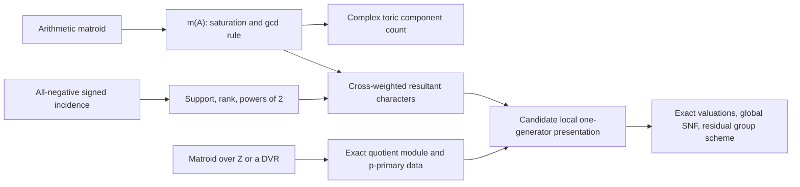

# Stage 4 arithmetic and graph-literature audit

**Object audited:** the frozen manuscript `manuscript.md`, with particular attention
to Theorems 6.1 and 7.1, Corollary 7.2, Appendix D, the Stage 3 R2 and R3 reports,
and the Stage 3 editorial roadmap. The separate Stage 4
`LOCAL_SMITH_THEOREM.md` was also read after it appeared, solely to state the
post-local-theorem contribution boundary accurately.

**Audit date:** 2026-08-09.

**Status:** bounded primary-source audit, not a priority certificate and not an
independent verification of the manuscript's proofs or of the internally proved Stage 4
local theorem.

## 1. Bottom-line judgement

**No fatal priority collision was found.** The bounded search did not locate an exact
antecedent for the complete, cross-weighted character list

\[
 \chi_{ij}=[e_j\varepsilon_i+e_i\varepsilon_j]
 \in \mathbb Z^k/\mathbb Z(1,\ldots,1),\qquad 1\leq i<j\leq k,
\]

its full cokernel, or the one-generator local presentation proved in the separate Stage 4
note

\[
 C_{\mathbf e}\otimes\mathbb Z_{(p)}
 \cong
 \mathbb Z_{(p)}/
 \left(e_a-\sum_{i\ne a}e_i,\;2e_ie_j\ (i<j,\ i,j\ne a)\right)
\]

for a \(p\)-unit vertex \(a\).

There is, however, a **material attribution correction**:

1. the saturation multiplicity \(m(A)\), its full-rank gcd-of-minors rule, and the
   identification of \(m(A)\) with the number of connected components of the
   associated complex toric intersection are standard;
2. the all-negative signed-incidence support, rank, and powers of two underlying the
   odd-unicyclic part of Theorem 6.1 are classical;
3. a matroid over \(\mathbb Z\), and locally over a DVR, is the established framework
   that retains the actual quotient module rather than only its order;
4. the equal-weight vectors \(\varepsilon_i+\varepsilon_j\) and their signed-graph arithmetic
   multiplicities have close classical-root-system antecedents;
5. the manuscript-specific candidate is therefore the **explicit arithmetic of this
   particular cross-weighted list in the diagonal quotient, together with its
   factorisation/resultant interpretation**, not the notions of multiplicity, gcd, toric
   component count, signed-graphic support, or Smith form themselves.

The separate Stage 4 theorem note supplies an internal proof of the local formula,
subject to incorporation audit and independent specialist checking. After that result,
the strongest arithmetic theorem package that remains manuscript-specific is:

> For the complete cross-weighted resultant-character list, compute the exact local
> quotient module at every prime by the displayed one-generator presentation; derive
> the choice-independent valuation formula and symmetric pair-exclusion formula for
> \(h(\mathbf e)\); prove that spanning-tree minors already generate the full maximal-minor
> gcd; assemble the primitive and nonprimitive Smith forms; and interpret the result as
> the residual diagonalizable group scheme of the resultant-character normalisation.

The frozen manuscript's primitive cyclicity and bad-prime-support theorem become
corollaries of this stronger local calculation. This conclusion is a bounded-search
assessment, not a claim that no equivalent theorem exists.

## 2. Exact standard identifications

Let

\[
 \Lambda=X^*(T)\cong\mathbb Z^k/\mathbb Z(1,\ldots,1),
 \qquad r=\operatorname{rank}\Lambda=k-1,
\]

and let \(X_{\mathbf e}=(\chi_{ij})_{ij\in E(K_k)}\) be the primitive edge-character
list. For a sublist \(A\subseteq X_{\mathbf e}\), put

\[
 \Lambda_A=\Lambda\cap\operatorname{span}_{\mathbb R}(A),
 \qquad
 m(A)=[\Lambda_A:\langle A\rangle_{\mathbb Z}].
\]

This is the standard representable arithmetic-matroid multiplicity.

### 2.1 The exact relation between \(h\) and \(m(E)\)

Because the complete primitive list has rank \(r=k-1\),

\[
 \boxed{h(\mathbf e)=m_{\mathbf e}(E)
 =[\Lambda:\langle X_{\mathbf e}\rangle]
 =\gcd_H |\det W_H(\mathbf e)|.}
\]

Here \(H\) may be restricted to independent \(r\)-edge sublists; including zero
maximal minors does not change the gcd. For an individual full-rank square sublist
\(H\),

\[
 \boxed{m_{\mathbf e}(H)=|\det W_H(\mathbf e)|.}
\]

Thus the full redundant-list invariant \(m(E)\) and a selected chart invariant \(m(H)\)
are standard but different arithmetic-matroid data.

There is an important scaling correction. If \(\mathbf d=g\mathbf e\), then every row is
multiplied by \(g\), so

\[
 \boxed{m_{\mathbf d}(E)=g^{k-1}h(\mathbf e),}
\]

not merely \(h(\mathbf e)\). This agrees with the order of the manuscript's stated
cokernel

\[
 (\mathbb Z/g)^{k-2}\oplus\mathbb Z/(g h(\mathbf e)).
\]

Any manuscript sentence saying simply “\(h=m(E)\)” must specify that it concerns the
primitive list.

### 2.2 The GCD rule

For a representable, torsion-free arithmetic matroid, D'Adderio--Moci's GCD rule is

\[
 m(A)=\gcd\{m(B):B\subseteq A,\ |B|=\operatorname{rk}(B)
 =\operatorname{rk}(A)\}.
\]

In a free ambient lattice, a square basis multiplicity is the absolute determinant in an
integral lattice basis. Consequently, the manuscript's definition of \(h(\mathbf e)\) is
exactly the standard GCD rule applied to the full primitive character list. What can be
new is the explicit evaluation of that multiplicity for this list, not the gcd
construction.

### 2.3 Toric-arrangement component count

Over the complex torus \(T_{\mathbb C}=\operatorname{Hom}(\Lambda,\mathbb C^*)\), set

\[
 H_A=\bigcap_{\chi\in A}\ker(\chi).
\]

Moci, Lemma 5.4, and D'Adderio--Moci, Lemma 4.1, prove

\[
 \boxed{\#\pi_0(H_A)=m(A).}
\]

For a full-rank list \(A\), \(H_A\) is finite, so this is its number of complex points.
For the present lists this gives

\[
 \#H_{E,\mathbf e}(\mathbb C)=h(\mathbf e),\qquad
 \#H_{E,\mathbf d}(\mathbb C)=g^{k-1}h(\mathbf e).
\]

This statement must not be transported without qualification to geometric-point
counts in characteristic \(p\). The finite diagonalizable group scheme
\(D(\Lambda/\langle A\rangle)\) has the indicated scheme order, but a factor
\(\mu_{p^a}\) is nonreduced in characteristic \(p\) and does not have \(p^a\) geometric
points. Moci's complex-torus component theorem and the manuscript's arbitrary-base
group-scheme statement are compatible but not identical assertions.

### 2.4 Module data beyond \(m(E)\)

For a vector configuration \(X\) in an \(R\)-module \(N\), Fink--Moci associate

\[
 M_X(A)=N/\sum_{x\in A}Rx.
\]

In the present setting, \(N=\Lambda\), so the full-set module is precisely

\[
 M_{X_{\mathbf e}}(E)=\Lambda/\langle X_{\mathbf e}\rangle=C_{\mathbf e}.
\]

The scalar arithmetic multiplicity remembers only

\[
 m(E)=|C_{\mathbf e}|,
\]

whereas the matroid-over-\(\mathbb Z\) object remembers the isomorphism class of the
finite abelian group. Localising at \(p\) places the calculation in the established
matroid-over-a-DVR framework. The Stage 4 local star elimination is therefore an
explicit computation of a standard kind of object for a special configuration; it is
not a new definition of local arithmetic-matroid data.

## 3. Source-by-source verification

### 3.1 Zaslavsky (1982), with 1983 erratum

**Primary source:** Thomas Zaslavsky, “Signed graphs,” *Discrete Applied
Mathematics* 4(1) (1982), 47--74,
[doi:10.1016/0166-218X(82)90033-6](https://doi.org/10.1016/0166-218X(82)90033-6).
The [author's publication record](https://people.math.binghamton.edu/zaslav/Tpapers/index.html)
links the primary paper and erratum and states exactly which clauses the erratum
corrects.

Verified locators:

- §7D, Corollary 7D.1, journal p. 66: an edge set in the all-negative signed graph
  is balanced exactly when the underlying unsigned subgraph is bipartite.
- §7D, Corollary 7D.3(d), pp. 66--67: dependence occurs on an even cycle or on a
  pair of odd cycles/half-edges connected within the edge set.
- §7D, Corollary 7D.3(j), p. 66: the rank is \(n-b(S)\), where \(b(S)\) counts
  bipartite components, including isolated vertices.
- §8A, pp. 68--69: the all-negative signed incidence matrix is the ordinary
  unoriented \(0,1\) incidence matrix, up to orientation/transpose convention.
- §8A, Lemma 8A.2, p. 69: a full-rank signed-incidence basis determinant is
  \(\pm2^\ell\), with one factor two per unbalanced circle.
- §8A, Lemma 8A.3, p. 69: signed-incidence minors are zero or divisors of powers of
  two.

**Erratum warning:** the author's record says the 1983 erratum corrects Theorem 5.1
and Corollary 7D.3(g). The frozen manuscript should not cite the original wording of
7D.3(g) as if uncorrected. Its needed support statement can be cited safely through
Corollary 7D.3(d),(j) and Lemmas 8A.2--8A.3, with the erratum explicitly listed.

**Boundary:** the all-negative signed-graphic/even-circle support and factor
\(2^{c-1}\) are classical. Appending the one degree row and evaluating it on the unique
tree-component bipartition vector gives the manuscript's balance factor; the degree
twist and resultant interpretation are not supplied by Zaslavsky.
In current terminology Zaslavsky's signed-graphic representation is the relevant
frame-matroid representation; its all-negative ordinary-graph specialization is the
even-circle matroid. The manuscript need not claim a new support matroid.

### 3.2 Grossman--Kulkarni--Schochetman (1995)

**Official source:** “On the minors of an incidence matrix and its Smith normal
form,” *Linear Algebra and its Applications* 218 (1995), 213--224,
[doi:10.1016/0024-3795(93)00173-W](https://doi.org/10.1016/0024-3795(93)00173-W).

The publisher abstract confirms that the paper determines the possible minors, rank,
extreme maximal-minor values, and Smith form of the ordinary unoriented incidence
matrix, with odd cycles controlling the answer. This remains the closest direct
matrix source already cited by the manuscript. Zaslavsky should precede it for the
signed-graphic conceptual framing.

### 3.3 Moci (2012)

**Primary text:** Luca Moci, “A Tutte polynomial for toric arrangements,”
*Transactions of the American Mathematical Society* 364(2) (2012), 1067--1088,
[doi:10.1090/S0002-9947-2011-05491-7](https://doi.org/10.1090/S0002-9947-2011-05491-7),
[author manuscript arXiv:0911.4823](https://arxiv.org/abs/0911.4823).

Verified locators:

- §2.2, pp. 3--4 of the author manuscript: \(\Lambda_A=\Lambda\cap
  \langle A\rangle_{\mathbb R}\) and \(m(A)=[\Lambda_A:\langle A\rangle_{\mathbb
  Z}]\).
- Immediately after the definition, p. 4: for a maximal-rank list in
  \(\mathbb Z^n\), \(m(A)\) is the gcd of the determinants of the bases extracted
  from \(A\); Eq. (1) identifies a basis multiplicity with absolute determinant.
- §5, Lemma 5.4, p. 16: \(m(A)\) equals the number of connected components of
  \(H_A=\bigcap_{\lambda\in A}\ker\lambda\).

**Boundary:** this source makes \(m(E)\), the determinant gcd, and the complex toric
component count standard. It does not compute the particular cross-weighted complete
list in the manuscript.

### 3.4 D'Adderio--Moci (2013)

**Primary text:** Michele D'Adderio and Luca Moci, “Arithmetic matroids, the Tutte
polynomial and toric arrangements,” *Advances in Mathematics* 232(1) (2013),
335--367,
[doi:10.1016/j.aim.2012.09.001](https://doi.org/10.1016/j.aim.2012.09.001),
[author manuscript arXiv:1105.3220](https://arxiv.org/abs/1105.3220).

Verified locators:

- §1.4, p. 5: for a list in a finitely generated abelian group, \(m(A)\) is the
  finite index of \(\langle A\rangle\) in its maximal finite-index overgroup.
- §1.5, pp. 7--8: the GCD rule is stated explicitly; Remark 1.6 says a
  representable torsion-free arithmetic matroid is GCD.
- §4.2, Lemma 4.1, p. 15: \(m(A)\) is the number of connected components of the
  generalized toric intersection \(H_A\).

**Boundary:** Theorem 6.1 can be presented as an explicit formula for the basis
multiplicities \(m(H)\), while Theorem 7.1/local Stage 4 work computes finer full-set
module data. The arithmetic-matroid language itself is antecedent.

### 3.5 Fink--Moci (2016)

**Official primary text:** Alex Fink and Luca Moci, “Matroids over a ring,”
*Journal of the European Mathematical Society* 18(4) (2016), 681--731,
[doi:10.4171/JEMS/600](https://doi.org/10.4171/JEMS/600),
[EMS article and PDF](https://ems.press/journals/jems/articles/13725).

Verified locators:

- Definition 2.1 and Eq. (2.1), journal pp. 683--684: a matroid over \(R\) assigns
  modules to sublists; a vector configuration \(X\subset N\) gives
  \(M_X(A)=N/\sum_{x\in A}Rx\).
- §5, especially Proposition 5.2, journal p. 704: DVR modules and quotient maps are
  controlled by their local invariant sequences. This is the relevant established
  setting for prime-local module structure.
- §6.1, Corollary 6.3 and Remark 6.4, journal pp. 716--717: over
  \(\mathbb Z\), \(m(A)=|M(A)_{\mathrm{tors}}|\); the matroid over
  \(\mathbb Z\) retains the torsion-group isomorphism class, not merely its
  cardinality.

**Boundary:** Fink--Moci supply the category and local language, not the manuscript's
one-generator presentation or its valuation formula.

### 3.6 Ardila--Castillo--Henley (2015)

**Official/primary text:** Federico Ardila, Federico Castillo, and Michael Henley,
“The Arithmetic Tutte Polynomials of the Classical Root Systems,” *International
Mathematics Research Notices* 2015(12) (2015), 3830--3877,
[doi:10.1093/imrn/rnu050](https://doi.org/10.1093/imrn/rnu050),
[author manuscript arXiv:1305.6621](https://arxiv.org/abs/1305.6621).

Verified locators:

- §4.2, pp. 22--23 of the author manuscript: a negative edge \(ij\) represents
  \(\varepsilon_i+\varepsilon_j\); loopless signed graphs give the type-\(D\) list.
- Lemma 4.9, pp. 23--24: for the standard integer lattice, a loopless unbalanced
  component contributes a factor two to the signed-root-list multiplicity.
- Lemmas 4.10--4.15, pp. 24--26: corresponding multiplicities are computed for
  types \(B,C,D\) in the integer, root, and weight lattices.

This is a close but not exact antecedent. For equal primitive degrees, the manuscript
has classes \([\varepsilon_i+\varepsilon_j]\) in
\(\mathbb Z^k/\mathbb Z(1,\ldots,1)\); for arbitrary degrees it has
\([e_j\varepsilon_i+e_i\varepsilon_j]\) with cross-weights at the endpoints.
Ardila--Castillo--Henley study signed-root vectors
\(\varepsilon_i+\varepsilon_j\) in the classical integer/root/weight lattices,
not this arbitrary cross-weighting in the diagonal quotient. Their type-\(A\) weight
lattice does use \(\mathbb Z^k/\mathbb Z\mathbf1\), but for difference vectors
\(\varepsilon_i-\varepsilon_j\), not the positive-sum list at issue here.

### 3.7 Lorenzini (2008)

**Primary text:** Dino J. Lorenzini, “Smith normal form and Laplacians,” *Journal of
Combinatorial Theory, Series B* 98(6) (2008), 1271--1300,
[doi:10.1016/j.jctb.2008.02.002](https://doi.org/10.1016/j.jctb.2008.02.002),
[author's accepted manuscript](https://dinolorenzini.franklinresearch.uga.edu/sites/default/files/inline-files/papers/PaperAccepted.pdf).

The introduction, pp. 1--2 of the accepted manuscript, defines the torsion of the
cokernel of a graph Laplacian and records its component/sandpile/Picard/Jacobian or
critical-group names and spanning-tree order.

**Boundary:** the manuscript's group is the cokernel of a rectangular edge-character
map, not a reduced Laplacian. No degree-zero divisor lattice, chip-firing
interpretation, Matrix--Tree order formula, or canonical monodromy pairing has been
constructed. Lorenzini is useful adjacent Smith literature, but “critical group” or
“sandpile group” should not be used as a synonym for the present cokernel.

### 3.8 Adjacent vertex-weighted and arithmetical graph matrices

Two further sources suggested by the Stage 3 reviews were screened for an exact
weighted analogue:

- F. R. K. Chung and Robert P. Langlands, “A Combinatorial Laplacian with Vertex
  Weights,” *Journal of Combinatorial Theory, Series A* 75(2) (1996), 316--327,
  [doi:10.1006/jcta.1996.0080](https://doi.org/10.1006/jcta.1996.0080),
  [author PDF](https://fanchung.ucsd.edu/wp/lang.pdf). The abstract and §1 define a
  square vertex-weighted Laplacian and develop Matrix--Tree formulas for rooted
  directed spanning trees and forests. This is not the rectangular character matrix
  or its Smith cokernel.
- Dino J. Lorenzini, “Arithmetical Graphs,” *Mathematische Annalen* 285(3) (1989),
  481--501,
  [doi:10.1007/BF01455069](https://doi.org/10.1007/BF01455069). The official DOI and
  EuDML records place the paper in intersection-matrix and Smith-form theory. It is
  adjacent square Laplacian/intersection-matrix context; no identity for the present
  cross-weighted rectangular list was found there. The full technical comparison in
  this audit is therefore anchored in the accessible primary Lorenzini 2008 paper
  above, not inferred from the 1989 metadata alone.

### 3.9 Hanusa--Zaslavsky (2011): the closest complete-incidence determinant search hit

**Primary text:** Christopher R. H. Hanusa and Thomas Zaslavsky, “Determinants in
the Kronecker Product of Matrices: The Incidence Matrix of a Complete Graph,”
*Linear and Multilinear Algebra* 59(4) (2011), 399--411,
[doi:10.1080/03081081003586852](https://doi.org/10.1080/03081081003586852),
[author manuscript arXiv:0811.1930](https://arxiv.org/abs/0811.1930).

Verified locators:

- §2, pp. 1--2 of the author manuscript defines \(\operatorname{lcmd}(M)\) as the
  least common multiple of all square subdeterminants and defines the oriented
  complete-graph incidence matrix \(D(K_n)\).
- Theorem 2, pp. 3--4, computes
  \(\operatorname{lcmd}(A\otimes D(K_n))\) for an arbitrary integral
  \(m\times2\) matrix \(A\); Corollary 3 gives the \(2\times2\) specialization.

This is closer in wording than the Laplacian sources but is not an antecedent of the
manuscript's theorem. Its matrix is a Kronecker product with the oriented complete-graph
incidence matrix, and its invariant is the **least common multiple of all
subdeterminants**. The manuscript instead studies a cross-weighted signless edge list in
the diagonal quotient and the **gcd of full-rank minors/full Smith cokernel**. Neither
matrix nor arithmetic invariant specializes transparently to the other.

## 4. Exact-analogue search

The bounded search used combinations of the following formulations in arXiv and
general scholarly search, with technical conclusions accepted only from the primary or
official sources above:

- “all-negative signed incidence,” “even-circle matroid,” and “frame matroid”;
- “arithmetic matroid multiplicity gcd maximal minors”;
- “toric arrangement connected components character kernel”;
- “matroid over \(\mathbb Z\),” “matroid over a DVR,” and local Smith data;
- “vertex-weighted incidence matrix,” “weighted signless incidence matrix,”
  “cross-weighted incidence matrix,” and “diagonally scaled signless incidence Smith
  normal form”;
- the literal patterns \(d_j\varepsilon_i+d_i\varepsilon_j\),
  \(a_j\varepsilon_i+a_i\varepsilon_j\), and their quotient by
  the diagonal lattice;
- complete-graph character lattices, root/weight lattices, arithmetical graphs, and
  weighted Laplacians;
- “gcd of spanning-tree determinants,” “tree minors generate the Fitting ideal,”
  and the literal pair-exclusion-gcd patterns occurring in the Stage 4 closed formula.

No source located in this pass states the exact local presentation, closed global
pair-exclusion formula, or spanning-tree-gcd equality for this list. Ordinary
edge-weighted incidence matrices scale an entire edge column/row uniformly; the
manuscript's row for \(ij\) instead has the *opposite endpoint's degree* at each endpoint.
Over a field it can be written schematically as an edge factor times a reciprocal
vertex scaling of the signless incidence row,

\[
 (d_j,d_i)=d_i d_j(1/d_i,1/d_j),
\]

but this uses denominators and does not preserve integral Smith data. Arithmetical
graphs and weighted Laplacians likewise concern square Laplacian-type matrices rather
than this rectangular list in the diagonal quotient.

Accordingly, the “no exact analogue found” result supports continued investigation but
does not establish priority.

## 5. Contribution boundary after a proved local valuation theorem

| Layer | Status after this audit | Exact boundary |
|---|---|---|
| All-negative signed-incidence support and rank | Classical | Zaslavsky §7D; original Cor. 7D.3(g) must be read with erratum |
| Odd-unicyclic determinant factors \(2^c\) | Classical | Zaslavsky §8A; Grossman--Kulkarni--Schochetman is the direct unoriented-matrix source |
| Appended degree-row balance and degree product | Factorisation-specific specialization | Not located verbatim; follows by the manuscript's diagonal transformation and tree-kernel pairing |
| Arithmetic multiplicity \(m(A)\) | Standard | Saturation index of a represented list |
| Full-rank gcd of maximal/basis determinants | Standard | Moci §2.2 and D'Adderio--Moci §1.5 |
| \(h(\mathbf e)=m_{\mathbf e}(E)\) | Standard identification | Only for the primitive list; the unscaled multiplicity is \(g^{k-1}h\) |
| \(m(A)=\#\pi_0(H_A)\) over \(\mathbb C\) | Standard | Moci Lemma 5.4; D'Adderio--Moci Lemma 4.1 |
| Quotient module/SNF rather than its order | Standard framework | Matroids over \(\mathbb Z\) and DVRs, Fink--Moci |
| Equal-weight \(\varepsilon_i+\varepsilon_j\) signed-root lists | Classical adjacent case | Ardila--Castillo--Henley §4.2; ambient lattice differs |
| Complete cross-weighted diagonal-quotient local presentation | Manuscript-specific candidate | Proved in the Stage 4 note; no exact antecedent found; still requires independent checking |
| Choice-independent exact \(v_p(h)\), primitive cyclicity, and scaled global SNF derived from that presentation | Manuscript-specific candidate theorem package | Proved in the Stage 4 note; the notions are standard but the explicit calculation was not located |
| Symmetric pair-exclusion formula and \(O(k^2)\) arithmetic computation of \(h\) | Manuscript-specific candidate | No exact antecedent found in the focused formula search |
| Equality of spanning-tree gcd and full maximal-minor gcd | Manuscript-specific candidate | Standard GCD formalism does not imply this restriction to the tree bases; no exact antecedent found |
| Residual group scheme as a resultant-character normalisation kernel | Factorisation-specific interpretation | Must remain relative to the chosen resultant-character list |
| Critical/sandpile-group interpretation | Not established | A Smith cokernel alone is insufficient |



## 6. Recommended exact manuscript insertions

The following text is insertion-ready in substance. Citation keys may be adjusted to
the repository bibliography.

### 6.1 Section 6.1, immediately before Theorem 6.1

> Up to transpose and choices of edge orientation, \(B_H\) is the signed incidence
> matrix of the all-negative signed graph \(-H\). In this representation, balance is
> bipartiteness, the rank defect counts bipartite components, and unbalanced
> unicyclic components contribute determinant factors of two; see Zaslavsky
> [1982, §7D, Cor. 7D.1 and 7D.3(d),(j), and §8A, Lemmas 8A.2--8A.3], read with
> the 1983 erratum. Thus the signed-graphic support and powers of two below are
> classical. The factorisation-specific step is the degree-dependent integral
> transformation from resultant characters to \(B_H\), followed by evaluation of
> the appended degree row on the tree component's bipartition kernel.

Do not cite original Corollary 7D.3(g) without the erratum.

### 6.2 Section 7, immediately after the definition of \(h(\mathbf e)\)

> This gcd is standard representable arithmetic-matroid data. Let
> \(\Lambda=X^*(T)\) and let \(X_{\mathbf e}\) be the complete primitive edge-character
> list. For \(A\subseteq X_{\mathbf e}\), define
> \(m(A)=[\Lambda\cap\operatorname{span}_{\mathbb R}(A):\langle A\rangle]\).
> Since \(X_{\mathbf e}\) has full rank,
> \(h(\mathbf e)=m(E)\); for a full-rank square sublist \(H\),
> \(m(H)=|\det W_H(\mathbf e)|\), and the equality for \(m(E)\) is the standard
> GCD rule [Moci 2012, §2.2; D'Adderio--Moci 2013, §§1.4--1.5]. For the original
> list \(\mathbf d=g\mathbf e\), the corresponding full-list multiplicity is
> \(m_{\mathbf d}(E)=g^{k-1}h(\mathbf e)\).

### 6.3 After incorporation of the proved Stage 4 local theorem

> The list also defines a representable matroid over \(\mathbb Z\), whose full-set
> module is
> \(M_X(E)=X^*(T)/\langle X_{\mathbf e}\rangle=C_{\mathbf e}\)
> [Fink--Moci 2016, Definition 2.1 and Eq. (2.1)]. The arithmetic multiplicity
> records only \(|C_{\mathbf e}|\); the matroid-over-\(\mathbb Z\) and local DVR
> viewpoints retain its isomorphism type and \(p\)-primary structure
> [ibid., §5 and §6.1]. The preceding proposition is an explicit computation of
> that standard object for the complete cross-weighted resultant-character list.

### 6.4 In the geometric interpretation following Theorem 7.1

> Over the complex torus, \(m(A)\) equals the number of connected components of
> \(H_A=\bigcap_{\chi\in A}\ker\chi\) [Moci 2012, Lemma 5.4;
> D'Adderio--Moci 2013, Lemma 4.1]. Hence the primitive full list has
> \(h(\mathbf e)\) common-kernel points over \(\mathbb C\), and the unscaled list has
> \(g^{k-1}h(\mathbf e)\). Over an arbitrary base, the appropriate object is instead
> the finite diagonalizable group scheme \(D(X^*(T)/L)\); in bad characteristic its
> scheme order must not be conflated with its number of geometric points.

### 6.5 Section 6 or Appendix D, adjacent-root-system comparison

> The equal-weight vectors \(\varepsilon_i+\varepsilon_j\) are the all-negative
> signed-root vectors used for types \(B\) and \(D\), whose arithmetic multiplicities are computed by
> Ardila--Castillo--Henley [2015, §4.2, Lemmas 4.9--4.15]. The present list differs
> in two ways: it lies in the diagonal quotient
> \(\mathbb Z^k/\mathbb Z\mathbf1\), and arbitrary degrees produce the
> cross-weighted vectors \(e_j\varepsilon_i+e_i\varepsilon_j\). The cited root-system formulas are
> therefore close context, not the complete-edge Smith theorem proved here.

### 6.6 Wherever critical-group language appears

> Although graph critical groups motivate useful Smith-form comparisons, the present
> cokernel is not a critical or sandpile group as defined: it is not the cokernel of a
> reduced Laplacian, and no degree-zero divisor lattice, chip-firing model, or canonical
> monodromy pairing has been supplied; compare Lorenzini [2008].

### 6.7 Replacement Appendix D rows

Replace the current single “Signless incidence minors and Smith theory” row by four
rows:

| Object in this paper | Closest examined antecedent | Established part | Candidate increment |
|---|---|---|---|
| Signed support of resultant-character bases | Zaslavsky 1982 + 1983 erratum; Grossman--Kulkarni--Schochetman 1995 | All-negative signed-incidence rank, dependence, odd-cycle support, and powers of two | Degree-row balance, cross-degree product, and resultant interpretation |
| Complete-graph incidence subdeterminants | Hanusa--Zaslavsky 2011 | Least common multiple of all minors of \(A\otimes D(K_n)\) for a fixed two-column factor \(A\) | Gcd of maximal minors and full Smith module of a different cross-weighted signless list in the diagonal quotient |
| Multiplicity of the complete character list | Moci 2012; D'Adderio--Moci 2013 | Saturation multiplicity, GCD rule, and complex toric component count | Explicit evaluation for the complete cross-weighted diagonal-quotient list |
| Exact full-set quotient module | Fink--Moci 2016; Ardila--Castillo--Henley 2015 as adjacent root-list case | Matroid-over-ring/DVR framework and equal-weight signed-root multiplicities | One-generator local presentation, exact valuations, scaled global SNF, and resultant-relative residual group scheme |

## 7. Citation-ready metadata

Metadata was checked against DOI content negotiation and the official journal/article
records. The Ardila--Castillo--Henley paper was first published online in 2014 but
belongs to the 2015 volume/issue; the journal citation year below is therefore 2015.

```bibtex
@article{Zaslavsky1982,
  author  = {Zaslavsky, Thomas},
  title   = {Signed Graphs},
  journal = {Discrete Applied Mathematics},
  year    = {1982},
  volume  = {4},
  number  = {1},
  pages   = {47--74},
  doi     = {10.1016/0166-218X(82)90033-6}
}

@article{Zaslavsky1983Erratum,
  author  = {Zaslavsky, Thomas},
  title   = {Signed Graphs},
  journal = {Discrete Applied Mathematics},
  year    = {1983},
  volume  = {5},
  number  = {2},
  pages   = {248},
  doi     = {10.1016/0166-218X(83)90047-1},
  note    = {Erratum to Discrete Applied Mathematics 4 (1982), 47--74}
}

@article{Moci2012,
  author  = {Moci, Luca},
  title   = {A Tutte Polynomial for Toric Arrangements},
  journal = {Transactions of the American Mathematical Society},
  year    = {2012},
  volume  = {364},
  number  = {2},
  pages   = {1067--1088},
  doi     = {10.1090/S0002-9947-2011-05491-7}
}

@article{DAdderioMoci2013,
  author  = {D'Adderio, Michele and Moci, Luca},
  title   = {Arithmetic Matroids, the {T}utte Polynomial and Toric Arrangements},
  journal = {Advances in Mathematics},
  year    = {2013},
  volume  = {232},
  number  = {1},
  pages   = {335--367},
  doi     = {10.1016/j.aim.2012.09.001}
}

@article{FinkMoci2016,
  author  = {Fink, Alex and Moci, Luca},
  title   = {Matroids over a Ring},
  journal = {Journal of the European Mathematical Society},
  year    = {2016},
  volume  = {18},
  number  = {4},
  pages   = {681--731},
  doi     = {10.4171/JEMS/600}
}

@article{ArdilaCastilloHenley2015,
  author  = {Ardila, Federico and Castillo, Federico and Henley, Michael},
  title   = {The Arithmetic {T}utte Polynomials of the Classical Root Systems},
  journal = {International Mathematics Research Notices},
  year    = {2015},
  volume  = {2015},
  number  = {12},
  pages   = {3830--3877},
  doi     = {10.1093/imrn/rnu050}
}

@article{Lorenzini2008,
  author  = {Lorenzini, Dino J.},
  title   = {Smith Normal Form and Laplacians},
  journal = {Journal of Combinatorial Theory, Series B},
  year    = {2008},
  volume  = {98},
  number  = {6},
  pages   = {1271--1300},
  doi     = {10.1016/j.jctb.2008.02.002}
}

@article{ChungLanglands1996,
  author  = {Chung, Fan R. K. and Langlands, Robert P.},
  title   = {A Combinatorial Laplacian with Vertex Weights},
  journal = {Journal of Combinatorial Theory, Series A},
  year    = {1996},
  volume  = {75},
  number  = {2},
  pages   = {316--327},
  doi     = {10.1006/jcta.1996.0080}
}

@article{Lorenzini1989,
  author  = {Lorenzini, Dino J.},
  title   = {Arithmetical Graphs},
  journal = {Mathematische Annalen},
  year    = {1989},
  volume  = {285},
  number  = {3},
  pages   = {481--501},
  doi     = {10.1007/BF01455069}
}

@article{HanusaZaslavsky2011,
  author  = {Hanusa, Christopher R. H. and Zaslavsky, Thomas},
  title   = {Determinants in the {K}ronecker Product of Matrices: The Incidence Matrix of a Complete Graph},
  journal = {Linear and Multilinear Algebra},
  year    = {2011},
  volume  = {59},
  number  = {4},
  pages   = {399--411},
  doi     = {10.1080/03081081003586852}
}

@article{GrossmanKulkarniSchochetman1995,
  author  = {Grossman, Jerrold W. and Kulkarni, Devadatta M. and Schochetman, Irwin E.},
  title   = {On the Minors of an Incidence Matrix and Its {S}mith Normal Form},
  journal = {Linear Algebra and its Applications},
  year    = {1995},
  volume  = {218},
  pages   = {213--224},
  doi     = {10.1016/0024-3795(93)00173-W}
}
```

## 8. Editorial consequence

The Stage 3 P1-2 requirement is satisfied at the audit level if the revision adopts the
boundaries above. The manuscript should not continue to present \(h\), its determinant
gcd, or its toric component interpretation as new. Conversely, the close sources do not
justify deleting the complete-edge theorem: the cross-weighted quotient-lattice module
and its exact local computation were not found in them.

The proportionate claim is:

> The paper applies standard arithmetic-matroid and signed-graphic structures to a
> factorisation-derived character list and internally proves an exact local/global Smith
> computation, closed index formula, and tree-gcd theorem for that special list. A
> bounded primary-source search found close
> equal-weight and incidence antecedents but no exact cross-weighted theorem; priority
> and independent verification remain unresolved pending specialist review.
